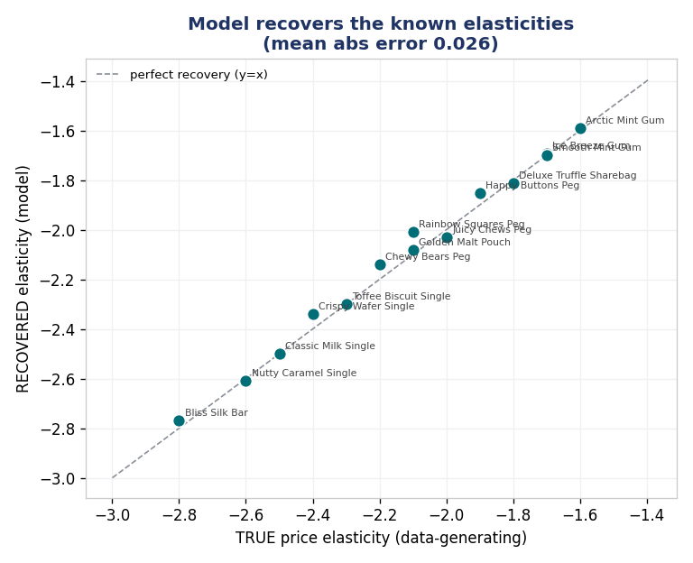
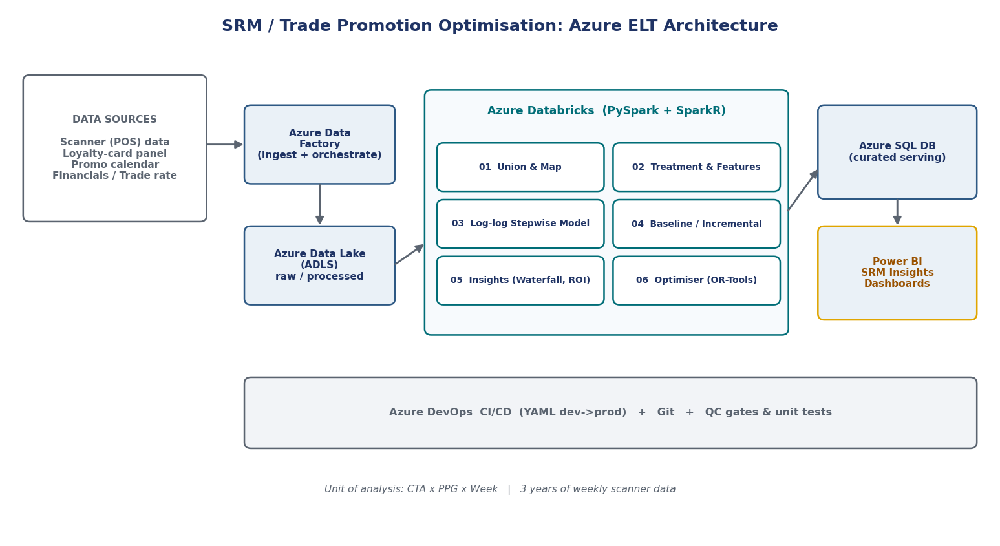

# Strategic Revenue Management & Trade Promotion Optimisation

End-to-end demand modelling and promotion optimisation for a consumer-goods portfolio: price
elasticity models per market and product group, baseline vs incremental decomposition, promotion
ROI, and an optimiser that recommends a more profitable promo calendar within business guardrails.
A second workstream applies marketing mix modelling at retailer level.

The pipeline runs locally in a few seconds on synthetic data. The data is generated with known
elasticities, so every result can be checked against the true answer. All brands, manufacturers
and retailers are fictional.

## Results (latest run)

| Metric | Result |
|---|---|
| Models fitted | **70** (14 product price groups x 5 markets) |
| Median R² (training) / median MAPE on held-out weeks | **0.989 / 5.1%** |
| Elasticity recovery (recovered vs true) | mean absolute error **0.026**; all 14 PPGs within 15% |
| Baseline vs incremental volume | **73% / 27%** |
| Promotion ROI, focal manufacturer | **0.33 to 0.44** incremental profit per $1 of trade spend |
| Optimiser, modelled profit pool | **+13.7%**, with trade spend down **62%** |
| MMM (retailer level) | 14 models, median R² **0.976**, elasticity error **0.034**, best-scenario profit **+25.6%** |



## Pipeline

| Stage | File | What it does |
|---|---|---|
| 00 | `src/s00_generate_sample_data.py` | Weekly scanner panel (CTA x PPG x week) with a known log-log data-generating process |
| 01 | `src/s01_union_map.py` | Ingest, raw-data QC (duplicates, nulls, non-positive values), dimension and financial mapping |
| 02 | `src/s02_treatment.py` | Log-log features, %ACV feature/display, seasonality, trend, pantry lag, competitor price slots, time-based split |
| 03 | `src/s03_modelling.py` | Log-log regression per CTA-PPG with stepwise AIC, VIF pruning and economic sign constraints |
| 04 | `src/s04_baseline.py` | Baseline vs incremental volume, split into price, feature, display, pantry and competition effects |
| 05 | `src/s05_insights.py` | Sales-driver waterfall, promotion efficiency and ROI, price ladder |
| 06 | `src/s06_optimiser.py` | Promo calendar optimiser under trade-spend, AUP, depth and no-promo-week guardrails |
| 07 | `src/s07_quality_checks.py` | QC gates and elasticity-recovery validation |
| | `src/viz.py`, `src/report.py` | Charts and a self-contained HTML dashboard |

## The model

```
log(units) = b0 + b1·log(price)                 # b1 = own-price elasticity (< 0)
                + b2·feature_%ACV + b3·display_%ACV
                + b4·log(seasonality) + b5·trend + b6·pantry_lag
                + Σ competitor log-prices        # intra = cannibalisation, inter = competition
```

- **Log-log form**, so coefficients read directly as elasticities.
- **Stepwise AIC, VIF pruning and sign constraints** keep 70 automated models stable and
  economically sensible (price must be negative, feature and display positive, and so on).
- **Time-based hold-out**: the last 20% of weeks per CTA-PPG are kept for testing.
- **Baseline** is the prediction with the promotion levers switched off; incremental volume is
  actual minus baseline.
- **Optimiser** keeps the same number of promo weeks but moves them to the weeks and depths with the
  highest profit gain, then trims depth until the trade-spend cap and average-unit-price floor hold.

## Architecture



The `databricks/` folder contains the same stages written for Azure Databricks: PySpark feature
engineering, per-group modelling with `groupBy().applyInPandas()`, and the optimiser as a binary
program in Google OR-Tools. Azure Data Factory handles orchestration, results are served from Azure
SQL to Power BI, and releases go through Azure DevOps CI/CD. The `src/` engine is the runnable
version and produces every result in this README.

## Marketing mix modelling (`mmm/`)

Retailer x promo group x week models for two grocery chains, using an elastic net (coordinate
descent with 5-fold CV and a relaxed OLS refit), correlation-based selection of cross-price
"acting items", contribution decomposition, ROI from trade terms, and scenario simulation. The R
versions of the same steps (glmnet) are in `mmm/r_reference/`. See [mmm/README.md](mmm/README.md).

## Run it

```bash
pip install -r requirements.txt
python run_all.py                    # SRM/TPO + MMM
python -m pytest tests/ -q           # unit tests
open outputs/dashboard.html          # SRM dashboard
open mmm/outputs/mmm_dashboard.html  # MMM dashboard
```

The walkthrough notebooks in `notebooks/` run each stage step by step.

## Repository layout

```
config.py            parameters, product groups and true elasticities
run_all.py           runs both workstreams
run_pipeline.py      SRM / TPO pipeline
src/                 pipeline stages s00 to s07, charts, dashboard
mmm/                 marketing mix modelling workstream (+ r_reference/)
databricks/          Databricks notebooks (PySpark, OR-Tools)
notebooks/           SRM and MMM walkthroughs
tests/               unit tests (VIF, OLS, sign rules, elasticity recovery)
docs/                architecture diagram
data/  outputs/      generated inputs and results
```

## Notes

- Base prices are held constant per product group so elasticity recovery can be measured cleanly.
  A live setup would add a separate base-price elasticity model and treat seasonal packs apart.
- Promotion ROI below 1.0 is expected: most trade promotions do not pay back on incremental profit
  alone, which is exactly why the optimiser cuts spend.

**Glossary:** PPG = product price group · CTA = census trading area · %ACV = share of stores
(weighted by all-commodity volume) running the support · TPR = temporary price reduction ·
AUP = average unit price · GSV = gross sales value.
